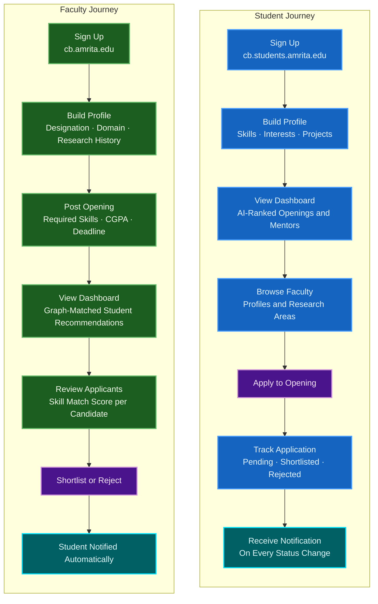
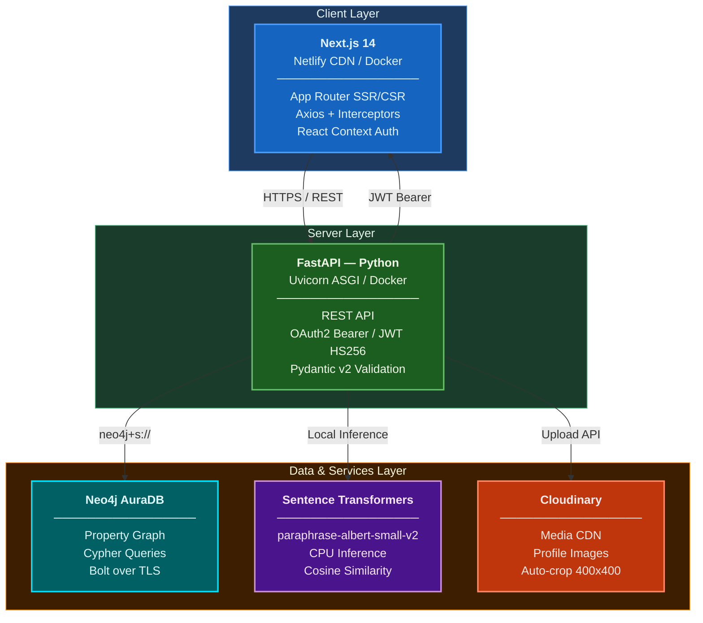
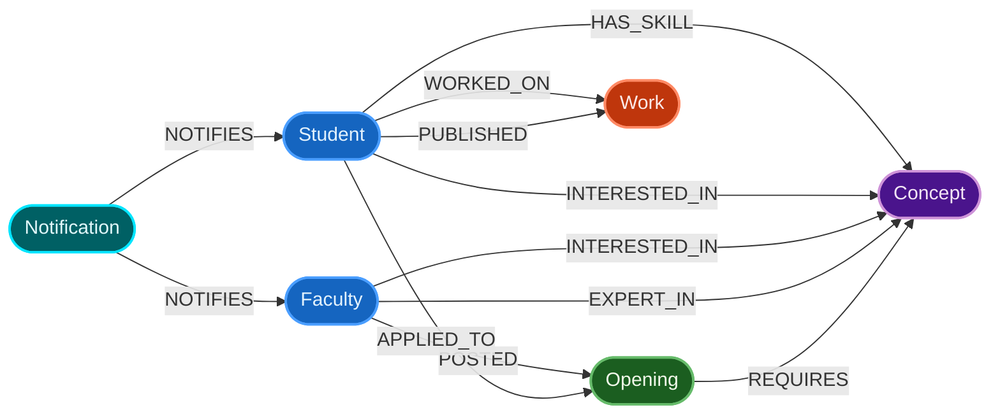
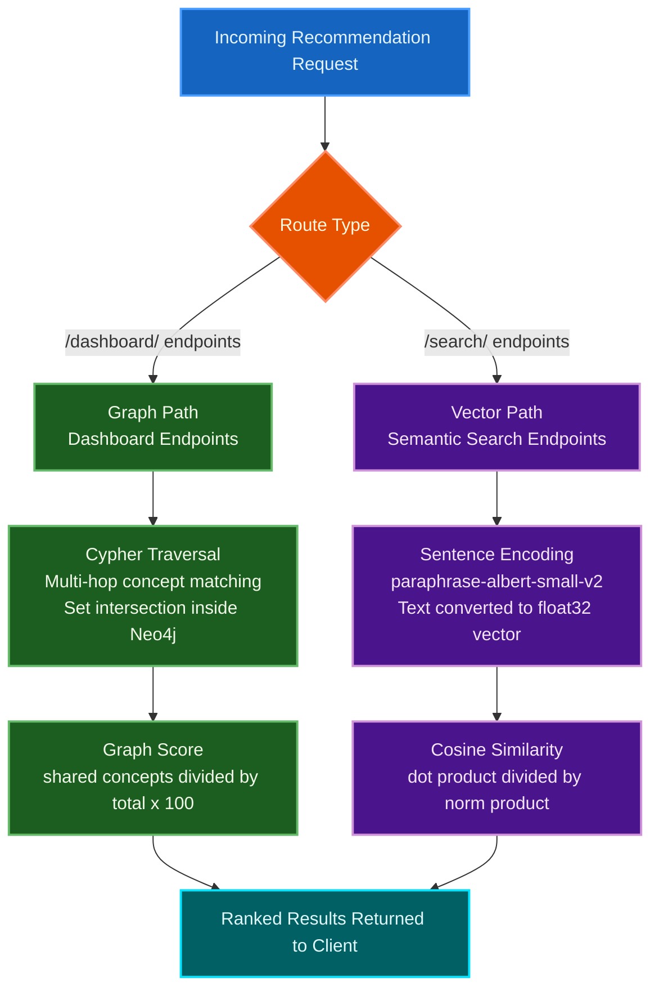

<div align="center">

# GuruSetu

**Bridge to the Teacher — AI-powered research collaboration between students and faculty.**

[](https://gurusetu.netlify.app)
[](https://fastapi.tiangolo.com)
[](https://nextjs.org)
[](https://neo4j.com)
[](https://www.typescriptlang.org)
[](https://python.org)


</div>

---

<div align="center">

An AI-driven academic research collaboration platform that connects students and faculty through **graph-based knowledge representation** and **semantic similarity matching** — built for Amrita University.

[View Live Demo](https://gurusetu.netlify.app) 

</div>

---

## Table of Contents

- [Overview](#overview)
- [Key Features](#key-features)
- [User Journey](#user-journey)
- [System Architecture](#system-architecture)
- [Repository Structure](#repository-structure)
- [Backend](#backend)
  - [Tech Stack](#backend-tech-stack)
  - [Graph Data Model](#graph-data-model)
  - [API Reference](#api-reference)
  - [AI and Recommendation Engine](#ai-and-recommendation-engine)
  - [Authentication and Security](#authentication-and-security)
  - [Environment Configuration](#environment-configuration)
  - [Running Locally](#running-the-backend-locally)
- [Frontend](#frontend)
  - [Tech Stack](#frontend-tech-stack)
  - [Application Structure](#application-structure)
  - [Service Layer](#service-layer)
  - [Running Locally](#running-the-frontend-locally)
- [Deployment](#deployment)
- [Contributing](#contributing)

---

## Overview

GuruSetu (Sanskrit: *"bridge to the teacher"*) is a research collaboration platform scoped to Amrita University. It enables students to discover faculty research openings, submit applications, and receive AI-ranked mentor recommendations — while faculty can post openings, define skill requirements, and identify best-fit candidates from the student body.

The platform models users, skills, interests, and research topics as a **property graph** in Neo4j. Recommendations are generated via Cypher-traversal-based graph scoring combined with vector cosine similarity computed from sentence-level embeddings.

The core problem it solves: research mentor-matching in academia is manual, opaque, and inefficient. GuruSetu automates this by representing the entire academic knowledge domain as a graph, where a student's skills and a faculty's research interests converge at shared `Concept` nodes — making compatibility quantifiable and discoverable.

---

## Key Features

**For Students**
- Personalized research opening recommendations ranked by skill-match percentage
- AI-powered faculty mentor discovery based on shared research interests
- Full application tracking pipeline with real-time status notifications
- Portfolio builder for projects, publications, and research interests

**For Faculty**
- Post research openings with fine-grained constraints (CGPA threshold, target batch, deadline, collaboration type)
- Graph-scored student candidate recommendations per opening
- Semantic search across the entire student body using natural language queries
- Cross-faculty collaboration discovery feed

**Platform**
- Dual-role authentication with institutional email enforcement (`@cb.amrita.edu` / `@cb.students.amrita.edu`)
- Knowledge graph with 6 node types and 9 typed relationship classes
- Hybrid recommendation engine: Cypher graph traversal for dashboards, vector cosine similarity for search
- Lightweight sentence-transformer inference (`paraphrase-albert-small-v2`, ~45MB) running on CPU
- Cloudinary-backed profile image storage with automatic face-crop

---

## User Journey



---

## System Architecture



---

## Repository Structure

```
GuruSetu/
├── gurusetu-backend/          # FastAPI application
│   ├── app/
│   │   ├── core/              # Configuration, database driver, security
│   │   ├── models/            # Pydantic request/response schemas
│   │   ├── routers/           # Route handlers (one module per domain)
│   │   └── services/          # Business logic, embedding, RAG pipeline
│   ├── scripts/               # DB constraint and sync utilities
│   ├── uploads/               # Local static file mount
│   ├── Dockerfile
│   └── requirements.txt
│
└── gurusetu-frontend/         # Next.js application
    ├── src/
    │   ├── app/               # App Router pages and layouts
    │   ├── components/        # Reusable UI components
    │   ├── context/           # React Context providers
    │   ├── hooks/             # Custom React hooks
    │   ├── services/          # Axios-based API service layer
    │   └── types/             # TypeScript interface definitions
    ├── Dockerfile
    └── package.json
```

---

## Backend

### Backend Tech Stack

| Dependency | Version | Purpose |
|---|---|---|
| FastAPI | 0.109.0 | ASGI web framework |
| Uvicorn | 0.27.0 | ASGI server |
| Pydantic | 2.6.0 | Request/response validation |
| pydantic-settings | 2.1.0 | Environment-based configuration |
| neo4j | 5.16.0 | Neo4j Python driver |
| python-jose | 3.3.0 | JWT encoding/decoding (HS256) |
| passlib + bcrypt | 1.7.4 + 4.0.1 | Password hashing |
| sentence-transformers | 2.6.1 | Semantic embedding generation |
| torch (CPU) | 2.5.1 | PyTorch runtime for transformer inference |
| cloudinary | latest | Profile image upload and storage |
| python-multipart | 0.0.9 | Multipart form data / file upload parsing |

---

### Graph Data Model

GuruSetu uses **Neo4j exclusively** as its data store. All entities — users, skills, openings, projects, and notifications — are modelled as nodes with typed relationships.

**Node Labels**

| Label | Description |
|---|---|
| `User` | Polymorphic user node — holds both `Student` and `Faculty` properties. Differentiated via a `role` property and optionally labeled `Student` or `Faculty`. |
| `Opening` | A research position posted by a faculty member, carrying constraints (CGPA, batch, deadline, collaboration type). |
| `Concept` | Normalized skill or interest term (stored as lowercase). Shared across users and openings for graph traversal. |
| `Work` | A project or publication node linked to a user. Type is encoded as a property (`Student Project`, `Publication`, `Faculty Work`). |
| `Notification` | Event notification node, directed to a specific user via the `NOTIFIES` relationship. |

**Relationships**

| Relationship | Direction | Semantics |
|---|---|---|
| `INTERESTED_IN` | `User → Concept` | Research interest (faculty and students) |
| `HAS_SKILL` | `User → Concept` | Declared skill (students) |
| `EXPERT_IN` | `User → Concept` | Declared expertise (faculty) |
| `POSTED` | `User → Opening` | Faculty ownership of an opening |
| `REQUIRES` | `Opening → Concept` | Skill requirement for a position |
| `APPLIED_TO` | `User → Opening` | Student application, carries `status` and `applied_at` as relationship properties |
| `WORKED_ON` | `User → Work` | Student project linkage |
| `PUBLISHED` | `User → Work` | Publication linkage |
| `NOTIFIES` | `Notification → User` | Delivery of a notification event to a user |



---

### API Reference

All endpoints operate under the prefix they are registered with in `main.py`. Protected endpoints require a `Bearer` token in the `Authorization` header.

#### Auth — `/auth`

| Method | Path | Access | Description |
|---|---|---|---|
| `POST` | `/auth/register` | Public | Register a new student or faculty account |
| `POST` | `/auth/login` | Public | Authenticate and receive a JWT |
| `POST` | `/auth/verify-identity` | Public | Verify identity before password reset |
| `POST` | `/auth/reset-password` | Public | Reset password with verified identity |

Registration enforces institutional email domains:

- Faculty: `@cb.amrita.edu`
- Students: `@cb.students.amrita.edu`

#### User Profiles — `/users`

| Method | Path | Access | Description |
|---|---|---|---|
| `POST` | `/users/upload-profile-picture` | Public | Upload profile image to Cloudinary (used during signup) |
| `GET` | `/users/student/profile/{user_id}` | Authenticated | Fetch full student profile with skills, interests, and linked work nodes |
| `PUT` | `/users/student/profile` | Authenticated | Update student profile, skills, interests, and projects |
| `GET` | `/users/faculty/profile/{user_id}` | Authenticated | Fetch full faculty profile with domain interests and previous work |
| `PUT` | `/users/faculty/profile` | Authenticated | Update faculty profile, designations, research areas |

Profile updates trigger graph mutations: `Concept` nodes are merged for skills and interests, and `Work` nodes are re-created with `WORKED_ON` / `PUBLISHED` relationships.

#### Research Openings — `/openings`

| Method | Path | Access | Description |
|---|---|---|---|
| `POST` | `/openings/` | Faculty | Create a new research opening with required skills and constraints |
| `DELETE` | `/openings/{opening_id}` | Faculty (owner) | Delete an owned opening and all its relationships |

An opening creation also performs a `MERGE` on each required skill as a `Concept` node and creates `REQUIRES` relationships, making the opening immediately traversable in the recommendation graph.

#### Dashboard — `/dashboard`

| Method | Path | Access | Description |
|---|---|---|---|
| `GET` | `/dashboard/faculty/home` | Faculty | Aggregated home data: graph-matched student recommendations, collaboration feed, unread notification count |
| `GET` | `/dashboard/student/home` | Student | Aggregated home data: recommended openings, faculty mentors, application statuses |

Dashboard endpoints execute multi-hop Cypher queries to compute match scores inline, avoiding round-trips. Student match scores are derived from skill overlap relative to the faculty's declared keywords.

#### Applications — `/applications`

| Method | Path | Access | Description |
|---|---|---|---|
| `POST` | `/applications/apply/{opening_id}` | Student | Submit an application; creates `APPLIED_TO` relationship and a notification to the faculty |
| `PUT` | `/applications/status` | Faculty | Update application status (`Shortlisted` / `Rejected`); triggers notification to the student |

#### Notifications — `/notifications`

| Method | Path | Access | Description |
|---|---|---|---|
| `GET` | `/notifications/` | Authenticated | Retrieve up to 20 most recent notifications ordered by creation time |
| `PUT` | `/notifications/{notif_id}/read` | Authenticated | Mark a notification as read |

#### Recommendations — `/recommend`

| Method | Path | Access | Description |
|---|---|---|---|
| `GET` | `/recommend/faculty/students` | Faculty | Graph-based student recommendations ranked by shared concept overlap |
| `GET` | `/recommend/openings/{opening_id}/students` | Faculty | Skill-match ranked student candidates for a specific opening |
| `GET` | `/recommend/student/mentors` | Student | Graph-based faculty mentor recommendations |
| `GET` | `/recommend/student/openings` | Student | Skill-overlap ranked opening recommendations |
| `GET` | `/recommend/search/students?q=` | Authenticated | Vector-similarity semantic search across student profiles |
| `GET` | `/recommend/search/faculty?q=` | Authenticated | Vector-similarity semantic search across faculty profiles |

---

### AI and Recommendation Engine

**Embedding Model**

The system uses `sentence-transformers/paraphrase-albert-small-v2` — a lightweight ALBERT-based model (~45MB) selected for its low CPU memory footprint in a containerized environment. The model is loaded lazily on first use and cached in module-level memory for the application lifetime.

```python
# services/embedding.py
model = SentenceTransformer('sentence-transformers/paraphrase-albert-small-v2')
embedding = model.encode(text)  # Returns a float32 numpy array
```

Embeddings are stored as vector properties on `User` nodes in Neo4j and used for cosine similarity ranking in semantic search queries.

**Graph-Based Scoring**

For dashboard recommendations, match scores are computed directly in Cypher using set intersection:

```cypher
-- Student-Faculty match (faculty dashboard)
WITH s, size([x IN s_skills WHERE x IN $f_keywords]) AS matches
match_score = (matches / total_faculty_keywords) * 100
```

This avoids transferring raw vectors to the application layer for bulk queries, keeping dashboard response times low.

**Cosine Similarity**

For vector-based endpoints, cosine similarity is computed with NumPy in the application layer:

```python
np.dot(a, b) / (np.linalg.norm(a) * np.linalg.norm(b))
```

**Recommendation Pipeline**



---

### Authentication and Security

- JWT tokens are signed with HS256, expire after 60 minutes, and carry `sub` (user_id) and `role` claims.
- Passwords are hashed with bcrypt via `passlib.CryptContext`.
- Route-level authorization is enforced via the `get_current_user` FastAPI dependency, which decodes the token and injects `{"user_id": str, "role": str}` into the handler.
- Role checks (`student` / `faculty`) are applied at the handler level for all protected mutations.
- CORS is restricted to `http://localhost:3000` and `https://gurusetu.netlify.app`.

---

### Environment Configuration

Create a `.env` file in `gurusetu-backend/`:

```env
# Neo4j AuraDB
NEO4J_URI=neo4j+s://<your-aura-instance>.databases.neo4j.io
NEO4J_USER=neo4j
NEO4J_PASSWORD=<your-password>

# JWT
JWT_SECRET_KEY=<random-256-bit-secret>
ALGORITHM=HS256
ACCESS_TOKEN_EXPIRE_MINUTES=60

# Cloudinary
CLOUDINARY_CLOUD_NAME=<your-cloud-name>
CLOUDINARY_API_KEY=<your-api-key>
CLOUDINARY_API_SECRET=<your-api-secret>

# Optional
OPENAI_API_KEY=<your-openai-key>
```

---

### Running the Backend Locally

**With Python**

```bash
cd gurusetu-backend

python -m venv venv
# Windows
venv\Scripts\activate
# macOS / Linux
source venv/bin/activate

pip install -r requirements.txt

uvicorn app.main:app --reload --port 8000
```

**With Docker**

```bash
cd gurusetu-backend
docker build -t gurusetu-backend .
docker run -p 8000:8000 --env-file .env gurusetu-backend
```

The interactive API documentation is available at `http://localhost:8000/docs`.

---

## Frontend

### Frontend Tech Stack

| Dependency | Version | Purpose |
|---|---|---|
| Next.js | 14.1.0 | React framework with App Router (SSR + CSR) |
| TypeScript | 5.x | Static typing |
| Tailwind CSS | 3.4 | Utility-first styling |
| tailwind-merge | 2.2.0 | Conditional Tailwind class merging |
| clsx | 2.1.0 | Conditional class construction |
| Axios | 1.6.0 | HTTP client |
| Lucide React | 0.300.0 | Icon library |
| react-hot-toast | 2.4.1 | Toast notification system |

---

### Application Structure

```
src/app/
├── (auth)/
│   ├── login/                  # Credential-based login
│   └── signup/                 # Role-aware registration
│
├── dashboard/
│   ├── layout.tsx              # Shared dashboard shell
│   │
│   ├── faculty/
│   │   ├── page.tsx            # Faculty home — recommended students, collaborations
│   │   ├── projects/           # Create and manage research openings
│   │   ├── all-students/       # Full student directory with skill filters
│   │   ├── collaborations/     # Cross-faculty collaboration feed
│   │   ├── notifications/      # Notification inbox
│   │   ├── profile/
│   │   │   ├── page.tsx        # Faculty profile editor
│   │   │   └── research/       # Research history and domain interests
│   │   └── support/
│   │
│   └── student/
│       ├── page.tsx            # Student home — recommended openings and mentors
│       ├── faculty/
│       │   ├── page.tsx        # Faculty directory
│       │   └── [id]/           # Dynamic faculty detail page
│       ├── applications/       # Application status tracker
│       ├── projects/           # Student project portfolio
│       ├── notifications/      # Notification inbox
│       ├── profile/
│       │   ├── page.tsx        # Student profile editor
│       │   ├── experience/     # Work and project history
│       │   └── interests/      # Research interests editor
│       └── support/
```

---

### Service Layer

All API communication is abstracted into dedicated service modules under `src/services/`. The Axios instance (`api.ts`) attaches the JWT from `localStorage` on every outbound request via a request interceptor and handles `401` responses globally.

```
services/
├── api.ts                      # Axios instance, JWT interceptor, error handler
├── authService.ts              # login, signup, logout calls
├── facultyDashboardService.ts  # Faculty home data
├── facultyProjectService.ts    # Opening CRUD
├── facultyService.ts           # Faculty profile operations
├── notificationService.ts      # Notification fetch and mark-read
├── studentDashboardService.ts  # Student home data
└── userService.ts              # Profile picture upload, generic user ops
```

Authentication state is managed via `AuthContext` (React Context + `useState`), persisting the user object to `localStorage`. Role-based routing is applied post-login — students are directed to `/dashboard/student`, faculty to `/dashboard/faculty`.

---

### Running the Frontend Locally

**With Node.js**

```bash
cd gurusetu-frontend
npm install
```

Create a `.env.local` file:

```env
NEXT_PUBLIC_API_URL=http://localhost:8000
```

```bash
npm run dev
```

The application will be available at `http://localhost:3000`.

**With Docker**

```bash
cd gurusetu-frontend
docker build -t gurusetu-frontend .
docker run -p 3000:3000 -e NEXT_PUBLIC_API_URL=http://localhost:8000 gurusetu-frontend
```

---

## Deployment

| Component | Platform | Notes |
|---|---|---|
| Frontend | Netlify | Deployed from the `gurusetu-frontend` directory. Set `NEXT_PUBLIC_API_URL` as a Netlify environment variable pointing to the backend. |
| Backend | Docker (any cloud runtime) | The `Dockerfile` uses `python:3.10-slim`. Sentence Transformers model is downloaded on first container startup; consider using a persistent volume or pre-baking the model into the image for faster cold starts. |
| Database | Neo4j AuraDB | Managed cloud. Connection uses `neo4j+s://` (Bolt over TLS). The driver is configured with `keep_alive=True` and `max_connection_lifetime=300s` for resilience. |
| Media | Cloudinary | Profile images are uploaded server-side and stored under the `guru_setu_profiles` folder with auto-cropping to `400×400` face-gravity. |

---

## Contributing

Contributions are welcome. To maintain consistency across the codebase, please follow these guidelines:

1. Fork the repository and create a feature branch from `main`.
2. Backend changes: ensure all new endpoints have role guards via `get_current_user` and validate inputs with Pydantic models.
3. Frontend changes: add new API calls to the appropriate service module rather than directly in components.
4. Graph schema changes: update `scripts/create_constraints.py` for any new node labels or uniqueness constraints.
5. Keep commits atomic and write descriptive commit messages.
6. Open a pull request against `main` with a clear description of the change and its motivation.

For significant changes, open an issue first to discuss the approach before investing in implementation.

---

## License

Distributed under the MIT License. See `LICENSE` for details.

---

## Acknowledgements

- [FastAPI](https://fastapi.tiangolo.com) — for the high-performance Python web framework
- [Neo4j AuraDB](https://neo4j.com/cloud/platform/aura-graph-database/) — for managed graph database hosting
- [Sentence Transformers](https://www.sbert.net) — for the open-source semantic embedding library
- [Cloudinary](https://cloudinary.com) — for media storage and transformation APIs
- [Netlify](https://netlify.com) — for frontend deployment and CDN
- [Amrita Vishwa Vidyapeetham](https://amrita.edu) — institutional context and domain inspiration

---

<div align="center">

Built with purpose at Amrita University · [https://gurusetu.netlify.app](https://gurusetu.netlify.app)

</div>
